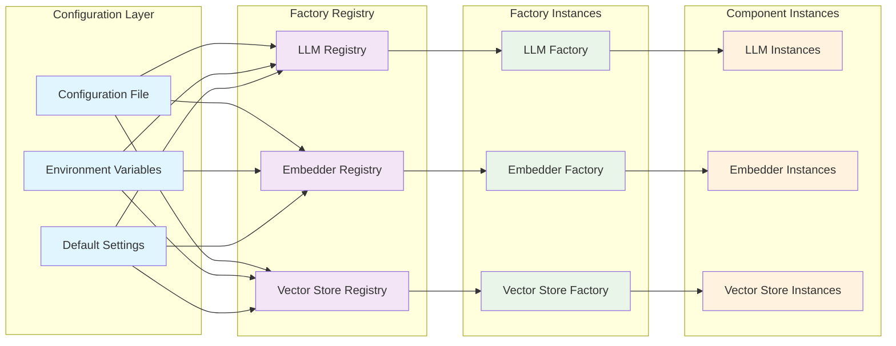
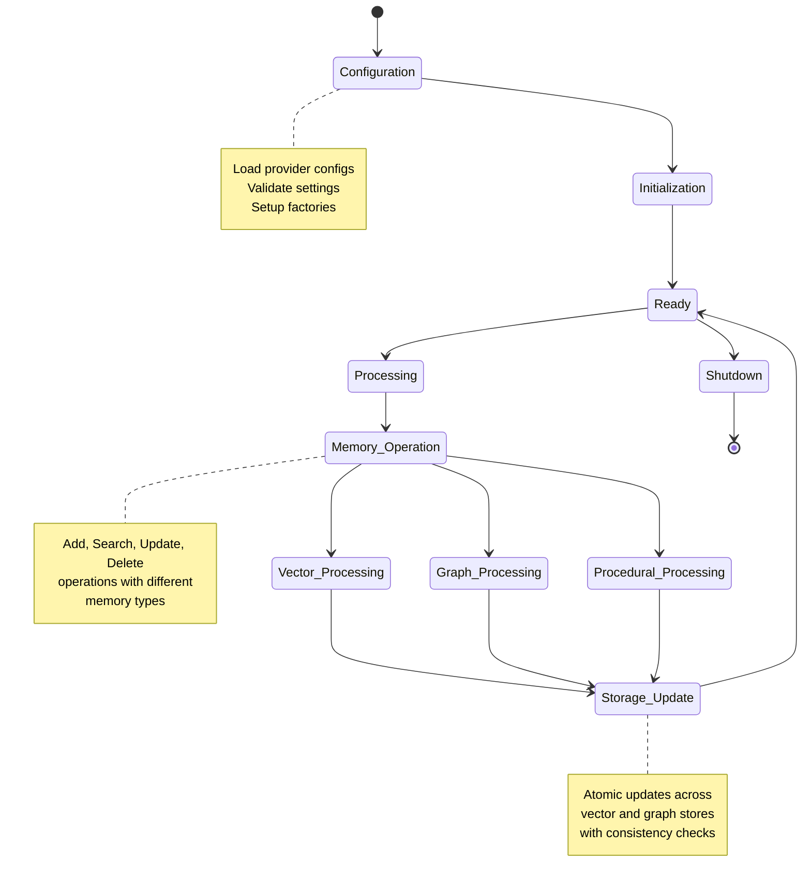

# Component Interaction Architecture

This document details the interaction patterns between Mem0's core components, highlighting bidirectional synergies and emergent behaviors.

## Core Component Interactions

The following diagram illustrates the bidirectional relationships between major system components:

```mermaid
graph LR
    subgraph "Client Interface Layer"
        CLIENT[Client API]
        SDK[SDK Interface]
        REST[REST Endpoints]
    end
    
    subgraph "Memory Management Layer"
        MEMORY[Memory Controller]
        STORAGE[Storage Manager]
        CONFIG[Configuration]
    end
    
    subgraph "Processing Layer"
        LLM_FACTORY[LLM Factory]
        EMB_FACTORY[Embedder Factory]
        VEC_FACTORY[Vector Store Factory]
    end
    
    subgraph "LLM Providers"
        OPENAI[OpenAI]
        GROQ[Groq]
        ANTHROPIC[Anthropic]
        OLLAMA[Ollama]
        GEMINI[Gemini]
    end
    
    subgraph "Embedding Providers"
        OPENAI_EMB[OpenAI Embeddings]
        HUGGINGFACE[HuggingFace]
        AZURE_EMB[Azure OpenAI]
        VERTEX[VertexAI]
    end
    
    subgraph "Vector Stores"
        QDRANT[Qdrant]
        CHROMA[ChromaDB]
        PINECONE[Pinecone]
        WEAVIATE[Weaviate]
        MILVUS[Milvus]
    end
    
    subgraph "Graph Stores"
        NEO4J[Neo4j]
        MEMGRAPH[Memgraph]
    end
    
    CLIENT ↔ MEMORY
    SDK ↔ MEMORY
    REST ↔ MEMORY
    
    MEMORY ↔ STORAGE
    MEMORY ↔ CONFIG
    
    MEMORY ↔ LLM_FACTORY
    MEMORY ↔ EMB_FACTORY
    MEMORY ↔ VEC_FACTORY
    
    LLM_FACTORY ↔ OPENAI
    LLM_FACTORY ↔ GROQ
    LLM_FACTORY ↔ ANTHROPIC
    LLM_FACTORY ↔ OLLAMA
    LLM_FACTORY ↔ GEMINI
    
    EMB_FACTORY ↔ OPENAI_EMB
    EMB_FACTORY ↔ HUGGINGFACE
    EMB_FACTORY ↔ AZURE_EMB
    EMB_FACTORY ↔ VERTEX
    
    VEC_FACTORY ↔ QDRANT
    VEC_FACTORY ↔ CHROMA
    VEC_FACTORY ↔ PINECONE
    VEC_FACTORY ↔ WEAVIATE
    VEC_FACTORY ↔ MILVUS
    
    STORAGE ↔ NEO4J
    STORAGE ↔ MEMGRAPH
    
    classDef client fill:#e1f5fe
    classDef memory fill:#f3e5f5
    classDef processing fill:#e8f5e8
    classDef llm fill:#fff3e0
    classDef embedding fill:#fce4ec
    classDef vector fill:#e0f2f1
    classDef graph fill:#f9fbe7
    
    class CLIENT,SDK,REST client
    class MEMORY,STORAGE,CONFIG memory
    class LLM_FACTORY,EMB_FACTORY,VEC_FACTORY processing
    class OPENAI,GROQ,ANTHROPIC,OLLAMA,GEMINI llm
    class OPENAI_EMB,HUGGINGFACE,AZURE_EMB,VERTEX embedding
    class QDRANT,CHROMA,PINECONE,WEAVIATE,MILVUS vector
    class NEO4J,MEMGRAPH graph
```

## Memory Type Interactions

This diagram shows how different memory types interact within the cognitive system:

```mermaid
graph TD
    subgraph "Input Layer"
        MESSAGES[Input Messages]
        METADATA[Metadata]
        FILTERS[Query Filters]
    end
    
    subgraph "Memory Processing Hub"
        PROCESSOR[Memory Processor]
        PARSER[Message Parser]
        EXTRACTOR[Fact Extractor]
    end
    
    subgraph "Vector Memory Subsystem"
        VEC_MEM[Vector Memory]
        EMBEDDING[Embedding Generation]
        VEC_SEARCH[Vector Search]
        VEC_STORE[Vector Storage]
    end
    
    subgraph "Graph Memory Subsystem"
        GRAPH_MEM[Graph Memory]
        ENTITY_EXTRACT[Entity Extraction]
        RELATION_EXTRACT[Relation Extraction]
        GRAPH_STORE[Graph Storage]
        GRAPH_SEARCH[Graph Search]
    end
    
    subgraph "Procedural Memory Subsystem"
        PROC_MEM[Procedural Memory]
        WORKFLOW_EXTRACT[Workflow Extraction]
        PROC_STORE[Process Storage]
    end
    
    subgraph "Output Layer"
        SYNTHESIZER[Memory Synthesizer]
        FORMATTER[Response Formatter]
        RESULTS[Query Results]
    end
    
    MESSAGES --> PROCESSOR
    METADATA --> PROCESSOR
    FILTERS --> PROCESSOR
    
    PROCESSOR --> PARSER
    PARSER --> EXTRACTOR
    
    EXTRACTOR --> VEC_MEM
    EXTRACTOR --> GRAPH_MEM
    EXTRACTOR --> PROC_MEM
    
    VEC_MEM --> EMBEDDING
    EMBEDDING --> VEC_STORE
    VEC_STORE --> VEC_SEARCH
    VEC_SEARCH --> SYNTHESIZER
    
    GRAPH_MEM --> ENTITY_EXTRACT
    GRAPH_MEM --> RELATION_EXTRACT
    ENTITY_EXTRACT --> GRAPH_STORE
    RELATION_EXTRACT --> GRAPH_STORE
    GRAPH_STORE --> GRAPH_SEARCH
    GRAPH_SEARCH --> SYNTHESIZER
    
    PROC_MEM --> WORKFLOW_EXTRACT
    WORKFLOW_EXTRACT --> PROC_STORE
    PROC_STORE --> SYNTHESIZER
    
    SYNTHESIZER --> FORMATTER
    FORMATTER --> RESULTS
    
    classDef input fill:#e3f2fd
    classDef processing fill:#f1f8e9
    classDef vector fill:#fff8e1
    classDef graph fill:#fce4ec
    classDef procedural fill:#e8eaf6
    classDef output fill:#e0f7fa
    
    class MESSAGES,METADATA,FILTERS input
    class PROCESSOR,PARSER,EXTRACTOR processing
    class VEC_MEM,EMBEDDING,VEC_SEARCH,VEC_STORE vector
    class GRAPH_MEM,ENTITY_EXTRACT,RELATION_EXTRACT,GRAPH_STORE,GRAPH_SEARCH graph
    class PROC_MEM,WORKFLOW_EXTRACT,PROC_STORE procedural
    class SYNTHESIZER,FORMATTER,RESULTS output
```

## Factory Pattern Implementation

The system uses factory patterns for component creation and management:



## Cross-Platform Synergies

The architecture supports multiple implementation platforms with shared cognitive patterns:

```mermaid
graph TB
    subgraph "Python Implementation"
        PY_MEMORY[Python Memory]
        PY_GRAPH[Python Graph Memory]
        PY_STORAGE[Python Storage]
    end
    
    subgraph "TypeScript Implementation"
        TS_MEMORY[TypeScript Memory]
        TS_GRAPH[TypeScript Graph Memory]
        TS_STORAGE[TypeScript Storage]
    end
    
    subgraph "Shared Protocols"
        API_PROTOCOL[API Protocol]
        GRAPH_PROTOCOL[Graph Protocol]
        VECTOR_PROTOCOL[Vector Protocol]
    end
    
    subgraph "External Services"
        HOSTED_API[Hosted API]
        NEO4J_SERVICE[Neo4j Service]
        VECTOR_SERVICES[Vector Services]
    end
    
    PY_MEMORY ↔ API_PROTOCOL
    PY_GRAPH ↔ GRAPH_PROTOCOL
    PY_STORAGE ↔ VECTOR_PROTOCOL
    
    TS_MEMORY ↔ API_PROTOCOL
    TS_GRAPH ↔ GRAPH_PROTOCOL
    TS_STORAGE ↔ VECTOR_PROTOCOL
    
    API_PROTOCOL ↔ HOSTED_API
    GRAPH_PROTOCOL ↔ NEO4J_SERVICE
    VECTOR_PROTOCOL ↔ VECTOR_SERVICES
    
    classDef python fill:#306998
    classDef typescript fill:#3178c6
    classDef protocol fill:#f39c12
    classDef external fill:#27ae60
    
    class PY_MEMORY,PY_GRAPH,PY_STORAGE python
    class TS_MEMORY,TS_GRAPH,TS_STORAGE typescript
    class API_PROTOCOL,GRAPH_PROTOCOL,VECTOR_PROTOCOL protocol
    class HOSTED_API,NEO4J_SERVICE,VECTOR_SERVICES external
```

## Component Lifecycle Management

This diagram shows how components are managed throughout their lifecycle:



## Recursive Pattern Integration

The system exhibits recursive patterns where memory operations create feedback loops for continuous learning:

- **Memory Formation → Retrieval → Refinement**: Each memory access refines future storage
- **Context Assembly → Response Generation → Context Update**: Response quality improves context assembly
- **Entity Extraction → Relationship Discovery → Enhanced Extraction**: Graph growth improves entity recognition

These recursive patterns enable the emergent cognitive behaviors that make Mem0 more than the sum of its parts.