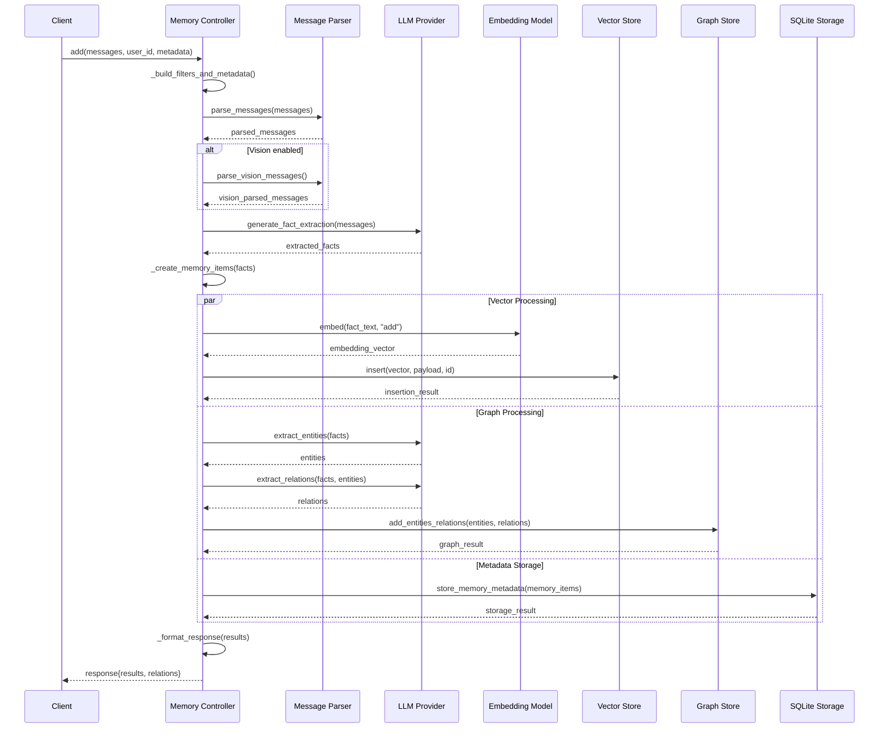
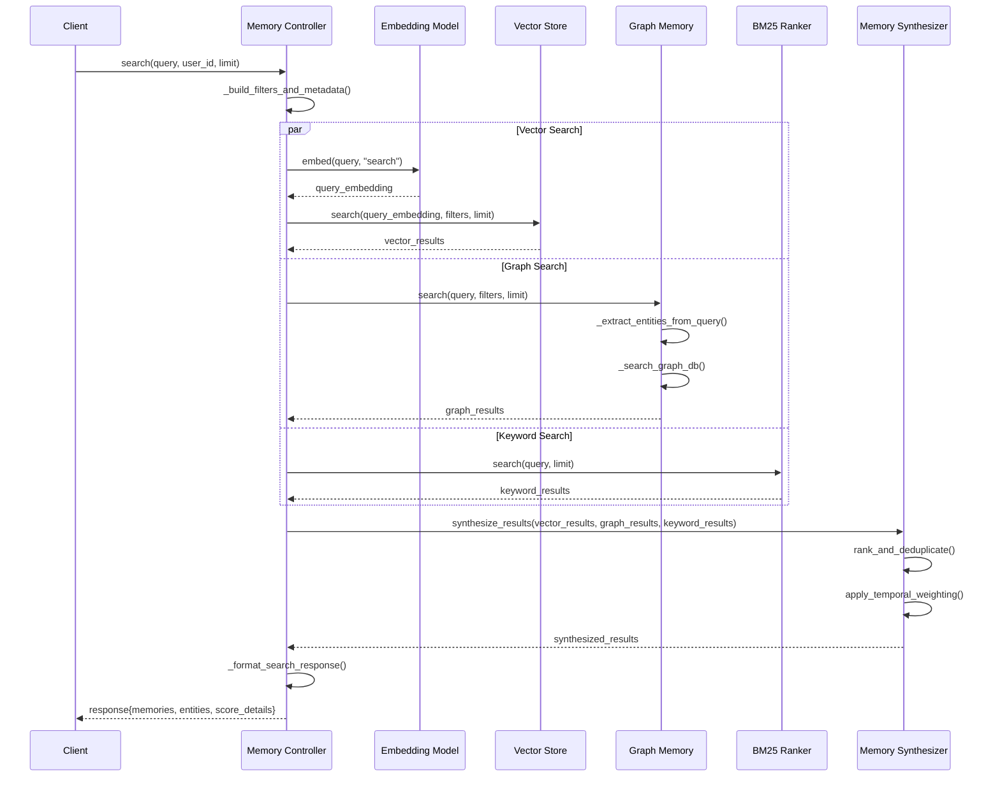
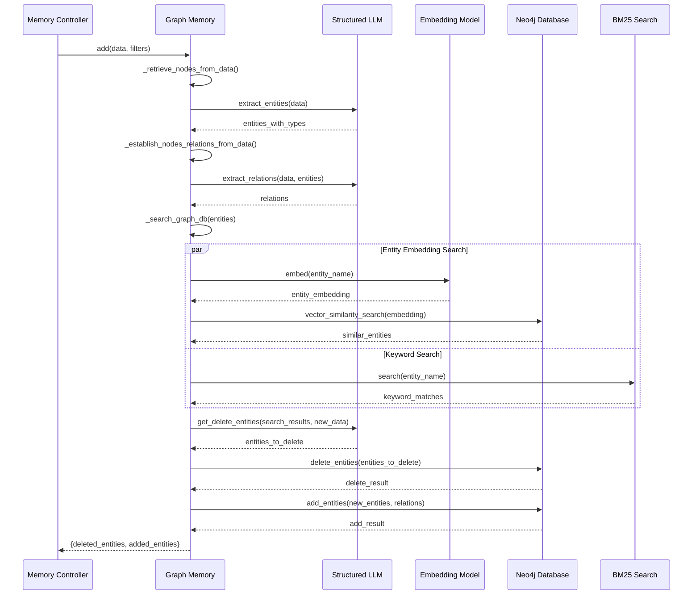
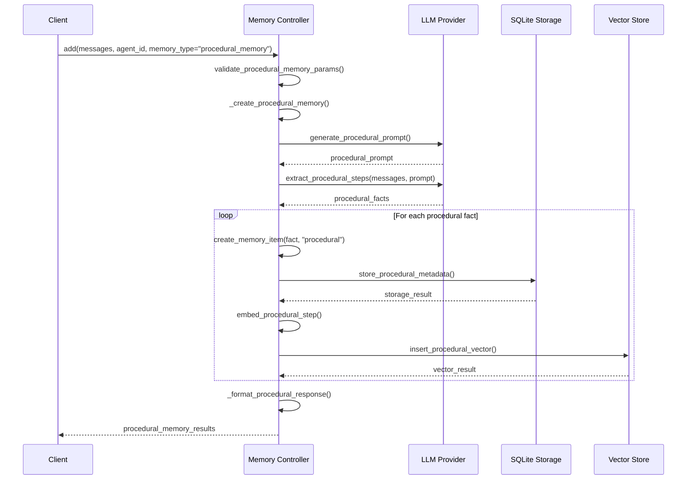
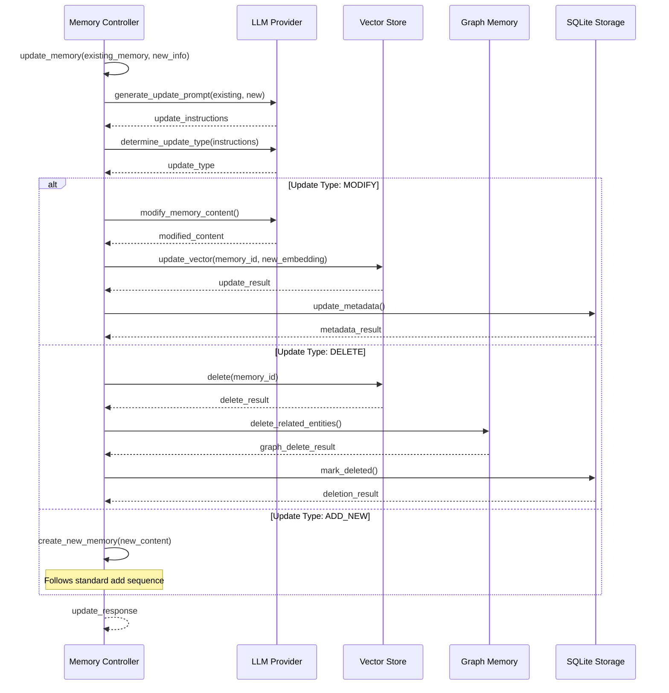
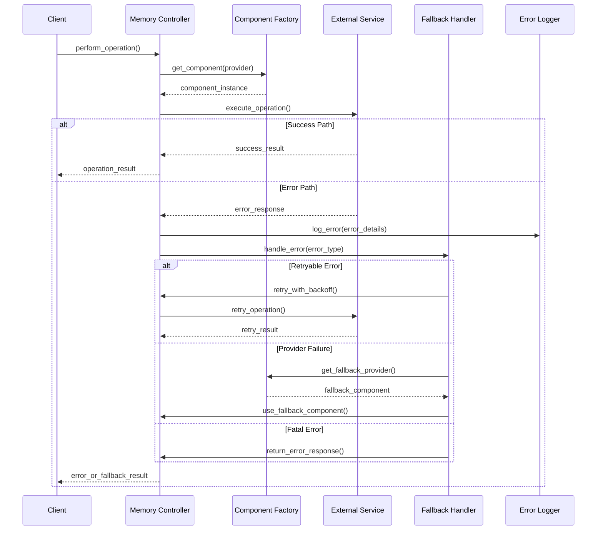
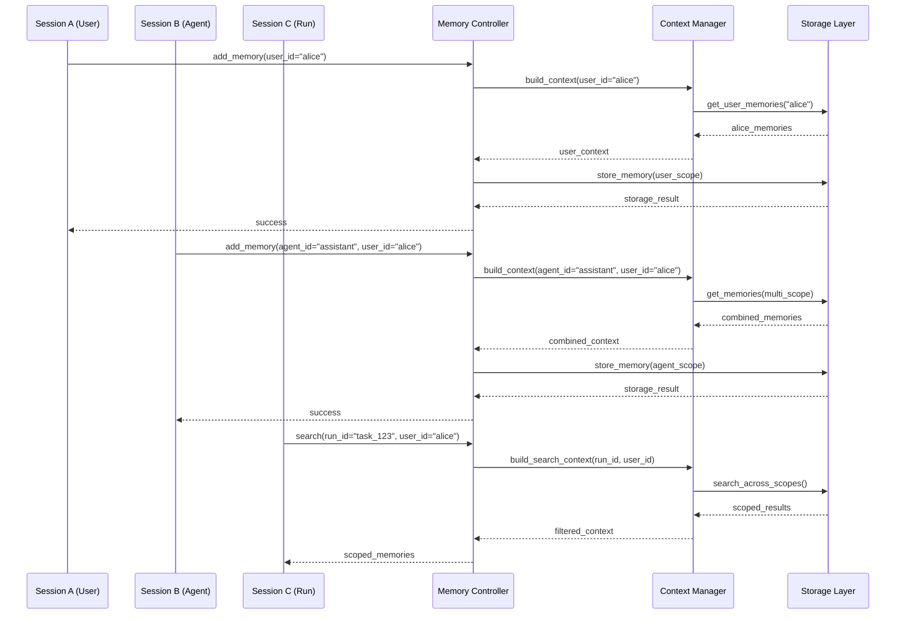
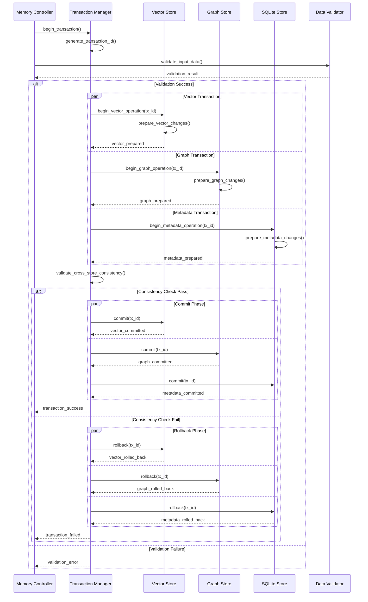

# Data Flow & Sequence Diagrams

This document provides detailed sequence diagrams that illustrate data and signal propagation pathways through Mem0's cognitive architecture.

## Memory Addition Sequence

The following sequence diagram shows the complete flow for adding a new memory to the system:

## Memory Search Sequence

This diagram illustrates the comprehensive search process across multiple memory types:

## Graph Memory Processing Sequence

This sequence shows the specific processing for graph-based memory operations:

## Procedural Memory Creation Sequence

This diagram shows the specific workflow for creating procedural memories:

## Update Memory Sequence

This sequence illustrates the complex process of updating existing memories:

## Error Handling and Recovery Sequence

This diagram shows the system's approach to error handling and recovery:

## Multi-Session Context Management

This sequence shows how the system manages context across multiple sessions:

## Data Consistency and Transaction Flow

This final sequence diagram illustrates how the system maintains data consistency across multiple storage backends:

These sequence diagrams capture the intricate data flow patterns that enable Mem0's emergent cognitive behaviors. Each sequence represents a critical pathway in the neural-symbolic integration that makes the system more than the sum of its individual components.