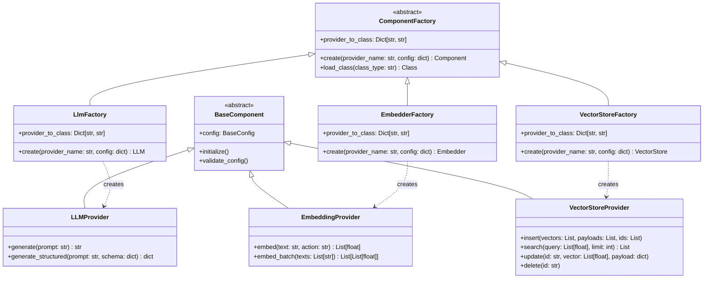
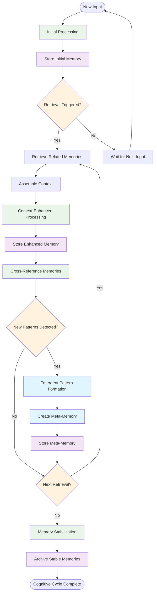
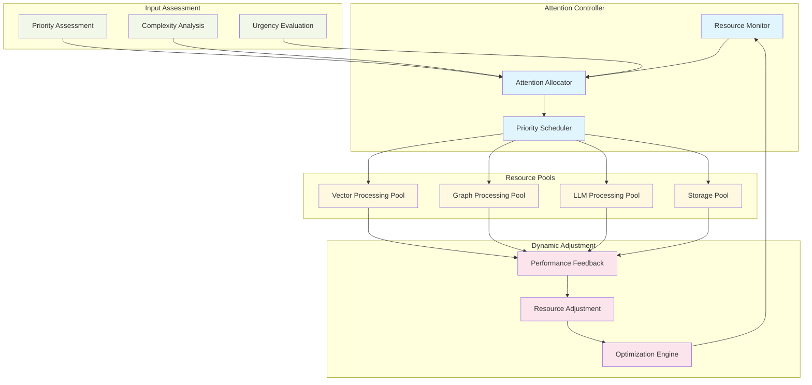
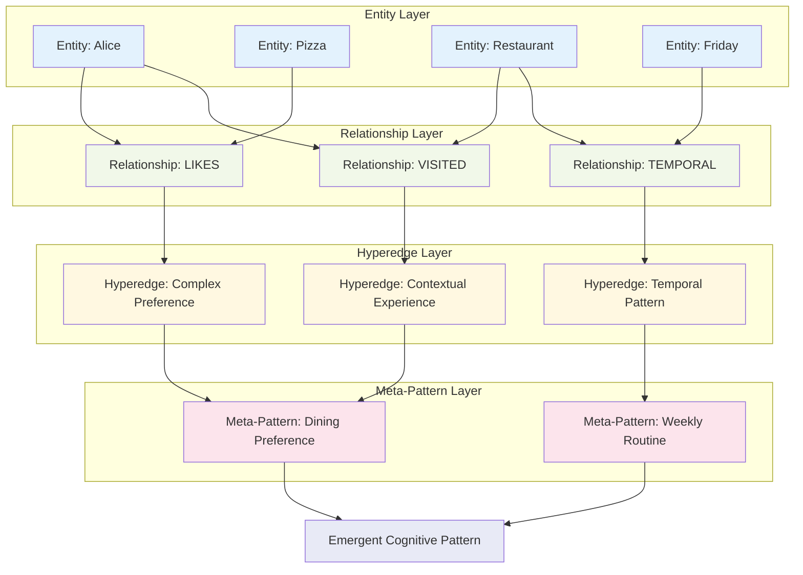
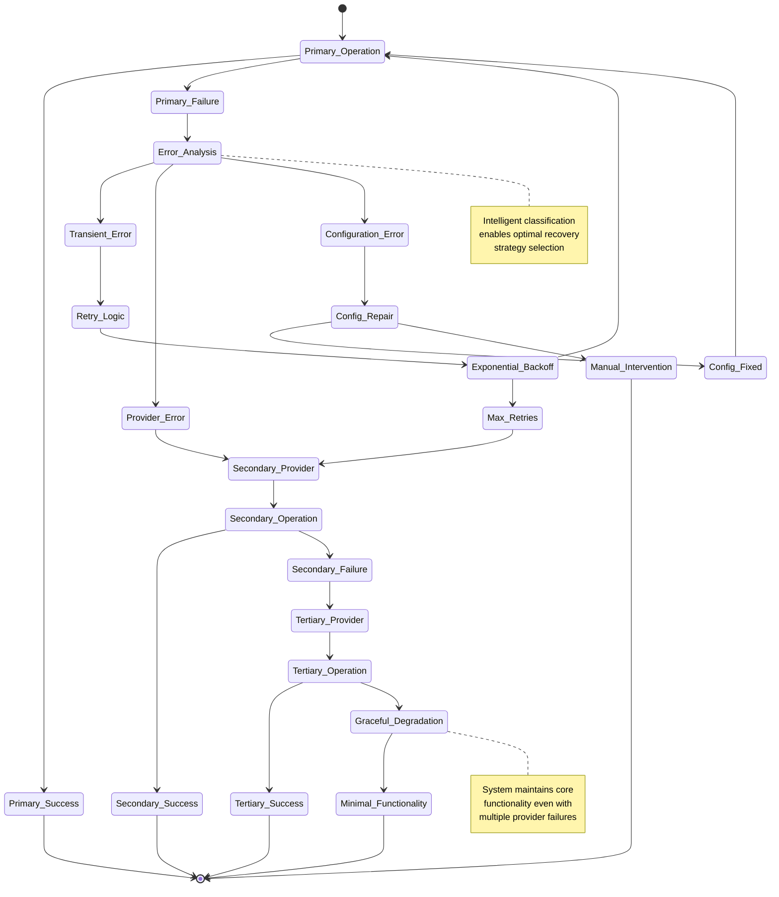
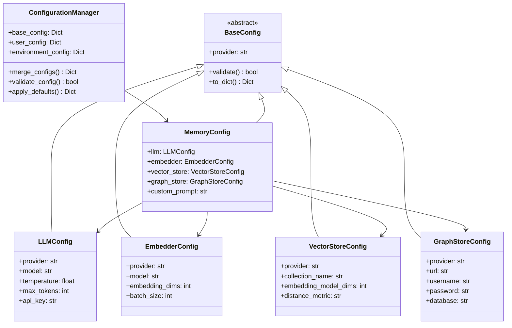
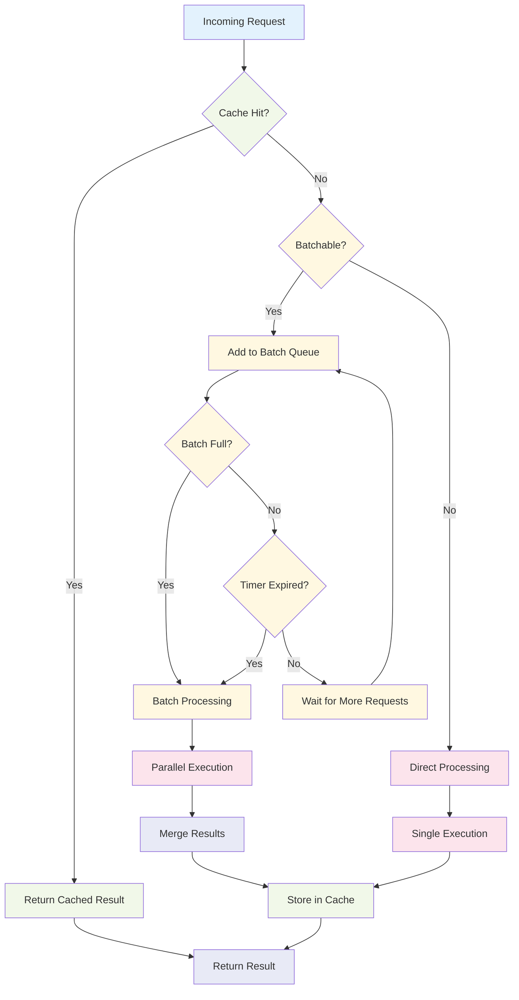

# Implementation Patterns

This document explores the key design patterns and implementation details that enable Mem0's cognitive architecture and emergent behaviors.

## Factory Pattern Implementation

The factory pattern is central to Mem0's component instantiation and provider abstraction:



## Memory Processing Pipeline Pattern

The memory processing follows a pipeline pattern with cognitive stages:

```mermaid
graph LR
    subgraph "Input Stage"
        INPUT[Raw Input]
        VALIDATE[Input Validation]
        NORMALIZE[Normalization]
    end
    
    subgraph "Cognitive Processing Stage"
        PARSE[Message Parsing]
        EXTRACT[Fact Extraction]
        ENRICH[Context Enrichment]
    end
    
    subgraph "Memory Formation Stage"
        VECTORIZE[Vectorization]
        GRAPHIFY[Graph Entity Creation]
        STRUCTURE[Memory Structuring]
    end
    
    subgraph "Storage Stage"
        VECTOR_STORE[Vector Storage]
        GRAPH_STORE[Graph Storage]
        META_STORE[Metadata Storage]
    end
    
    subgraph "Synthesis Stage"
        CORRELATE[Cross-Store Correlation]
        VALIDATE_CONSISTENCY[Consistency Validation]
        OUTPUT[Formatted Output]
    end
    
    INPUT --> VALIDATE
    VALIDATE --> NORMALIZE
    NORMALIZE --> PARSE
    
    PARSE --> EXTRACT
    EXTRACT --> ENRICH
    
    ENRICH --> VECTORIZE
    ENRICH --> GRAPHIFY
    ENRICH --> STRUCTURE
    
    VECTORIZE --> VECTOR_STORE
    GRAPHIFY --> GRAPH_STORE
    STRUCTURE --> META_STORE
    
    VECTOR_STORE --> CORRELATE
    GRAPH_STORE --> CORRELATE
    META_STORE --> CORRELATE
    
    CORRELATE --> VALIDATE_CONSISTENCY
    VALIDATE_CONSISTENCY --> OUTPUT
    
    classDef input fill:#e3f2fd
    classDef cognitive fill:#f1f8e9
    classDef formation fill:#fff8e1
    classDef storage fill:#fce4ec
    classDef synthesis fill:#e8eaf6
    
    class INPUT,VALIDATE,NORMALIZE input
    class PARSE,EXTRACT,ENRICH cognitive
    class VECTORIZE,GRAPHIFY,STRUCTURE formation
    class VECTOR_STORE,GRAPH_STORE,META_STORE storage
    class CORRELATE,VALIDATE_CONSISTENCY,OUTPUT synthesis
```



## Recursive Memory Formation Pattern

This pattern shows how memories recursively improve through feedback loops:



## Adaptive Attention Allocation Pattern

This shows how the system dynamically allocates cognitive resources:



## Cross-Platform Synchronization Pattern

This pattern enables consistent behavior across Python and TypeScript implementations:

```mermaid
sequenceDiagram
    participant PY as Python Implementation
    participant SYNC as Synchronization Layer
    participant TS as TypeScript Implementation
    participant PROTO as Protocol Validator
    
    PY->>SYNC: operation_request(data, metadata)
    SYNC->>PROTO: validate_protocol(request)
    PROTO-->>SYNC: validation_result
    
    alt Protocol Valid
        SYNC->>TS: synchronized_request(normalized_data)
        TS->>TS: process_request()
        TS-->>SYNC: response(result)
        SYNC->>PROTO: validate_response(result)
        PROTO-->>SYNC: response_validation
        
        alt Response Valid
            SYNC-->>PY: normalized_response(result)
        else Response Invalid
            SYNC->>SYNC: apply_correction_rules()
            SYNC-->>PY: corrected_response(result)
        end
    else Protocol Invalid
        SYNC->>SYNC: apply_compatibility_layer()
        SYNC->>TS: compatible_request(adapted_data)
        TS-->>SYNC: response(result)
        SYNC-->>PY: adapted_response(result)
    end
    
    note over SYNC, PROTO
        Ensures semantic consistency
        across implementation platforms
        while preserving cognitive patterns
    end note
```

## Hypergraph Memory Encoding Pattern

This pattern shows how complex relationships are encoded in the hypergraph structure:



## Error Recovery and Fallback Pattern

This pattern ensures system resilience through intelligent fallback mechanisms:



## Configuration Management Pattern

This pattern manages the complex configuration hierarchy across components:



## Performance Optimization Pattern

This pattern optimizes performance through caching and batching strategies:



These implementation patterns demonstrate how Mem0's architecture achieves its emergent cognitive behaviors through well-structured design patterns that enable scalability, resilience, and adaptive intelligence. Each pattern contributes to the overall system's ability to exhibit neural-symbolic integration and recursive learning capabilities.