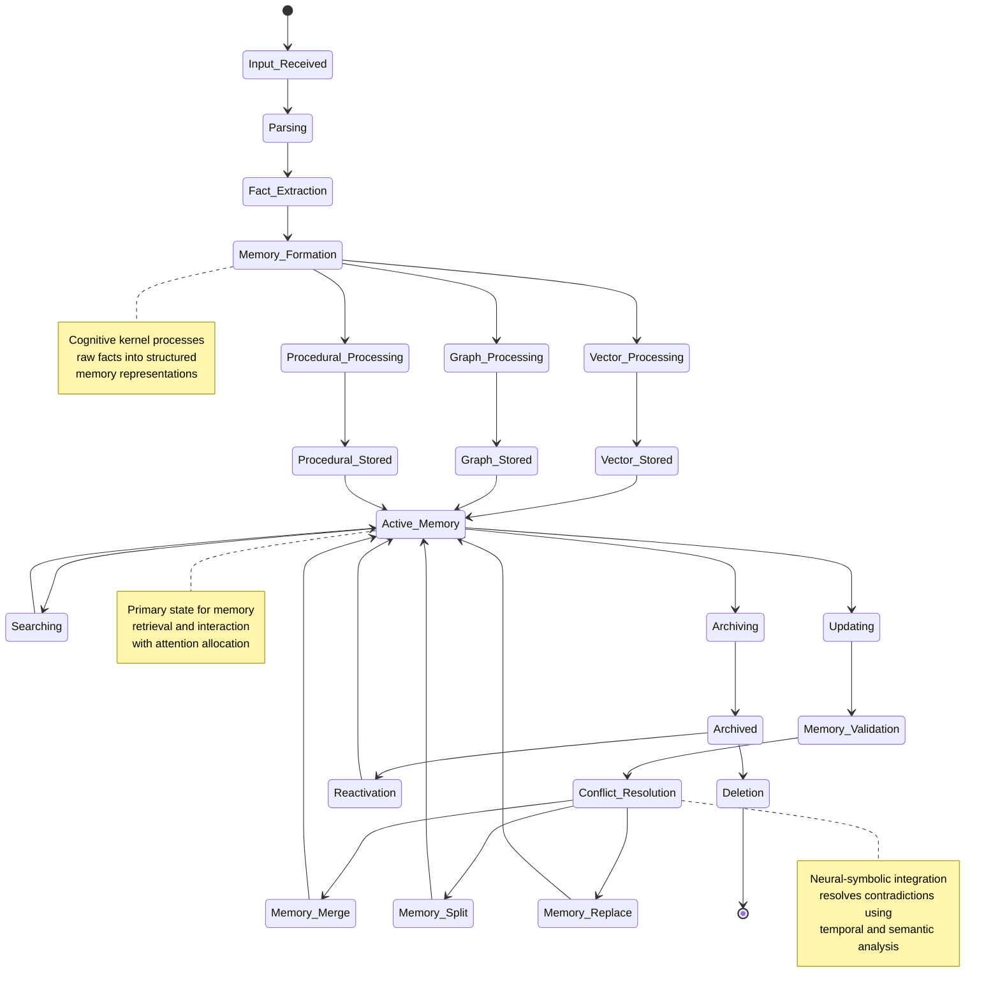
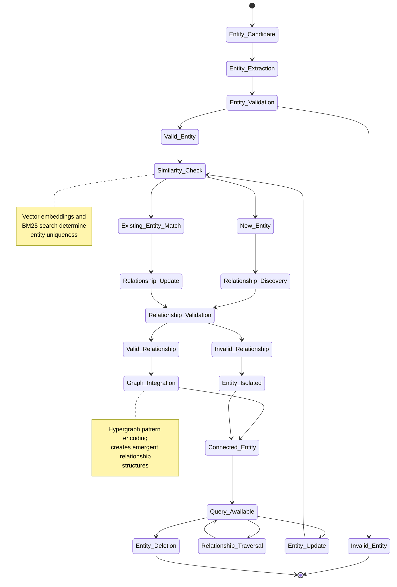
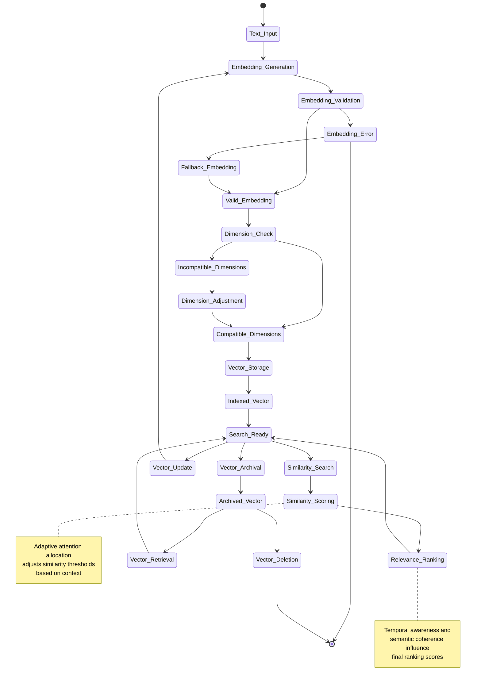
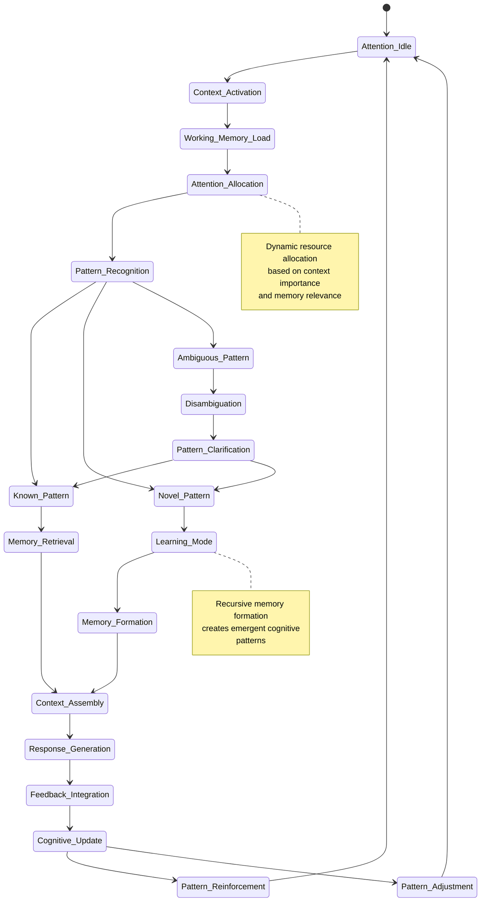
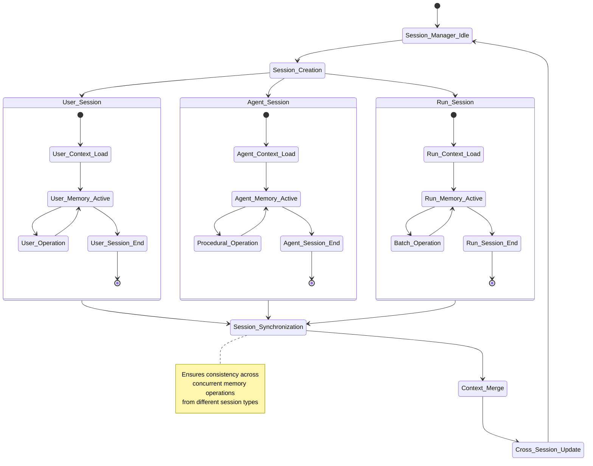
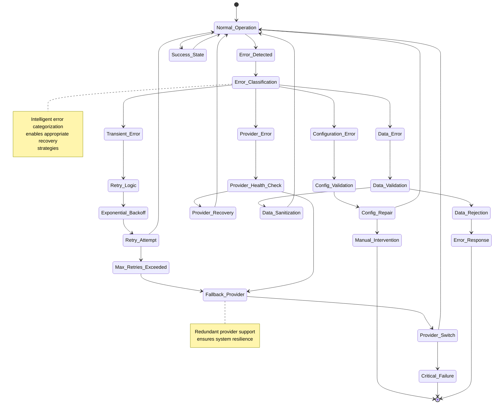
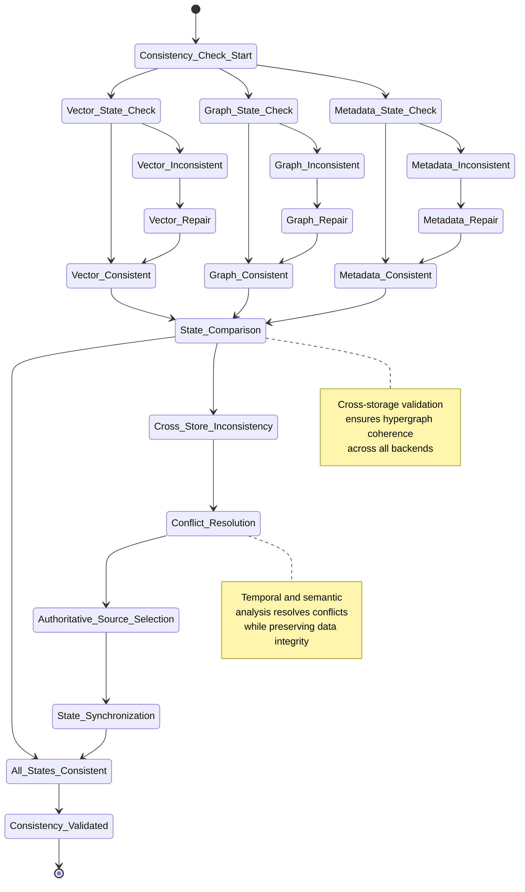

# Memory Lifecycle States

This document provides comprehensive state diagrams that model the lifecycle of memories and cognitive state transitions within Mem0's architecture.

## Memory Entity Lifecycle

The following state diagram shows the complete lifecycle of a memory entity from creation to deletion:

## Graph Memory State Transitions

This diagram models the specific state transitions for graph-based memory entities:

## Vector Memory State Management

This state diagram illustrates the lifecycle of vector-based memories:

## Cognitive Processing States

This diagram models the cognitive processing states that drive memory operations:

## Multi-Session State Coordination

This diagram shows how states are coordinated across multiple concurrent sessions:

## Error State Management

This state diagram models error handling and recovery states:

## Memory Consistency States

This final diagram shows the states involved in maintaining consistency across storage backends:

These state diagrams capture the dynamic nature of Mem0's cognitive architecture, showing how memories evolve through their lifecycle and how the system maintains coherence across multiple concurrent operations. The recursive patterns and emergent behaviors emerge from these state transitions, creating the adaptive intelligence that characterizes the system.