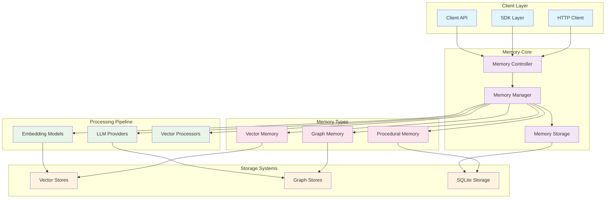
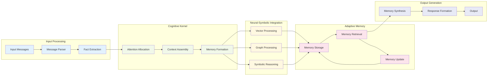

# Mem0 Architecture Overview

Mem0 is a sophisticated memory layer for AI applications that enables persistent, personalized, and context-aware interactions. The architecture is designed around hypergraph-centric principles with emergent cognitive patterns and neural-symbolic integration points.

## System Architecture

The following diagram illustrates the high-level system architecture, showing the principal flows and cognitive subsystems:

## Cognitive Flow Architecture

This diagram shows the recursive and emergent cognitive patterns within the system:

## Key Architectural Principles

### 1. Multi-Level Memory Hierarchy
- **Vector Memory**: Semantic similarity-based retrieval using high-dimensional embeddings
- **Graph Memory**: Relationship-aware storage enabling complex entity interactions
- **Procedural Memory**: Process and workflow storage for agent behaviors

### 2. Hypergraph Pattern Encoding
The system employs hypergraph structures to represent complex relationships between entities, enabling:
- Multi-dimensional relationship modeling
- Emergent pattern recognition
- Recursive memory formation and retrieval

### 3. Adaptive Attention Allocation
Dynamic attention mechanisms optimize memory formation and retrieval:
- Context-aware relevance scoring
- Temporal awareness for memory freshness
- Semantic coherence maintenance

### 4. Neural-Symbolic Integration
The architecture bridges neural (vector-based) and symbolic (graph-based) approaches:
- Vector embeddings capture semantic similarity
- Graph structures encode explicit relationships
- Symbolic reasoning enables logical inference

## Implementation Layers

The system is implemented across multiple programming languages and environments:

- **Python Core**: Primary implementation with full feature support
- **TypeScript SDK**: Client-side implementation for web applications
- **REST API**: Platform-agnostic HTTP interface
- **CLI Tools**: Command-line interface for development and testing

## Performance Characteristics

- **+26% Accuracy** over OpenAI Memory on the LOCOMO benchmark
- **91% Faster Responses** than full-context approaches
- **90% Lower Token Usage** compared to traditional context management

This architecture enables scalable, efficient, and intelligent memory management for AI applications while maintaining the flexibility to adapt to emerging cognitive patterns and use cases.